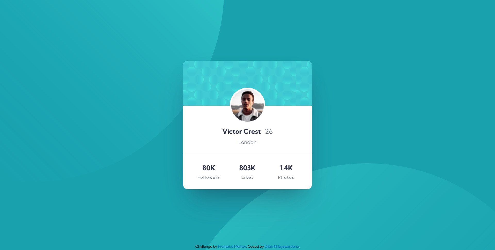

# Frontend Mentor - Profile card component solution

This is a solution to the [Profile card component challenge on Frontend Mentor](https://www.frontendmentor.io/challenges/profile-card-component-cfArpWshJ). Frontend Mentor challenges help you improve your coding skills by building realistic projects. 

## Table of contents

- [Overview](#overview)
  - [The challenge](#the-challenge)
  - [Screenshot](#screenshot)
  - [Links](#links)
- [My process](#my-process)
  - [Built with](#built-with)
  - [What I learned](#what-i-learned)
  - [Continued development](#continued-development)
  - [Useful resources](#useful-resources)
- [Author](#author)

## Overview

### The challenge

- Build out the project to the designs provided

### Screenshot




### Links

- Solution URL: [Add solution URL here](https://your-solution-url.com)
- Live Site URL: [Add live site URL here](https://your-live-site-url.com)

## My process

### Built with

- Semantic HTML5 markup
- CSS custom properties
- Flexbox
- SaSS
- Mobile-first workflow
- Google fonts
- Media queries

### What I learned

To develop this basic card component I totally used Sass for styling the mark up, in this challenge I learned that in Sass we are able to use css media queries within certain element, I do not need to worry about missing selectors and rules like when I use media query all at once below the stylesheet,

To see how you can add code snippets, see below:

```html
<div class="main-cont">
    <!-- background images goes here -->
    <figure class="main-cont__bg"></figure>

    <!-- avatar image goes here -->
    <figure class="main-cont__avtr"></figure>
    
    <!-- personel information section -->
    <div class="main-cont__desc">
      
      <!-- name and age -->
      <p class="main-cont__desc-name">
        Victor Crest
        <span class="main-cont__desc-name-age">26</span>
      </p>

      <!-- city name -->
      <p class="main-cont__desc-city">London</p>
    </div>

    <!-- status section -->
    <ul class="main-cont__status">
      <li>
        80K
        <span>Followers</span>
      </li>
      <li>
        803K
        <span>Likes</span>
      </li>
      <li>
        1.4K
        <span>Photos</span>
      </li>
    </ul>

  </div>
```
```scss
body {
  background-color: var(--Dark-cyan);
  background-image: url("../images/bg-pattern-top.svg"),
    url("../images/bg-pattern-bottom.svg");
  background-repeat: no-repeat, no-repeat;
  background-size: 1200px 1200px, 1200px 1200px;
  background-position: -150% 150%, 160% -120%;
  position: relative;
  display: flex;
  justify-content: center;
  align-items: center;

  @media (max-width: 375px) {
    background-position: 220% -80%, -170% 170%;
    background-size: 450px 450px, 450px 450px;
  }
}

// main container
.main-cont {
  background-color: var(--White);
  width: 400px;
  height: 400px;
  overflow: hidden;
  box-shadow: rgba(255, 255, 255, 0.1) 0px 1px 1px 0px inset,
    rgba(50, 50, 93, 0.25) 0px 50px 100px -20px,
    rgba(0, 0, 0, 0.3) 0px 30px 60px -30px;
  border-radius: 15px;
  -webkit-border-radius: 15px;
  -moz-border-radius: 15px;
  -ms-border-radius: 15px;
  -o-border-radius: 15px;
  position: relative;
  display: flex;
  flex-direction: column;

  @media (max-width: 375px) {
    width: 300px;
    margin: 0 20px;
  }
  // background image goes here
  &__bg {
    background-image: url("../images/bg-pattern-card.svg");
    height: 140px;
    width: 100%;
  }
  // avatar image goes here
  &__avtr {
    background-image: url("../images/image-victor.jpg");
    background-repeat: no-repeat;
    background-size: cover;
    background-position: center;
    border: 5px solid var(--White);
    width: 110px;
    height: 110px;
    border-radius: 50%;
    -webkit-border-radius: 50%;
    -moz-border-radius: 50%;
    -ms-border-radius: 50%;
    -o-border-radius: 50%;
    position: absolute;
    left: 50%;
    top: 21%;
    transform: translateX(-50%);
    -webkit-transform: translateX(-50%);
    -moz-transform: translateX(-50%);
    -ms-transform: translateX(-50%);
    -o-transform: translateX(-50%);
  }
```
```js
```

### Continued development

In future I am planning to add javasscript API stuff by doing that I wanna make this change dynamically based on real social media data


### Useful resources

- [Box shadow templates](https://getcssscan.com/css-box-shadow-examples) - This helped me for apply css box shadow without worrying so much.I really liked these box shadow styling and will use it going forward.

## Author

- Frontend Mentor - [Dilan M Jayawardena](https://www.frontendmentor.io/profile/iamdylanmj)


